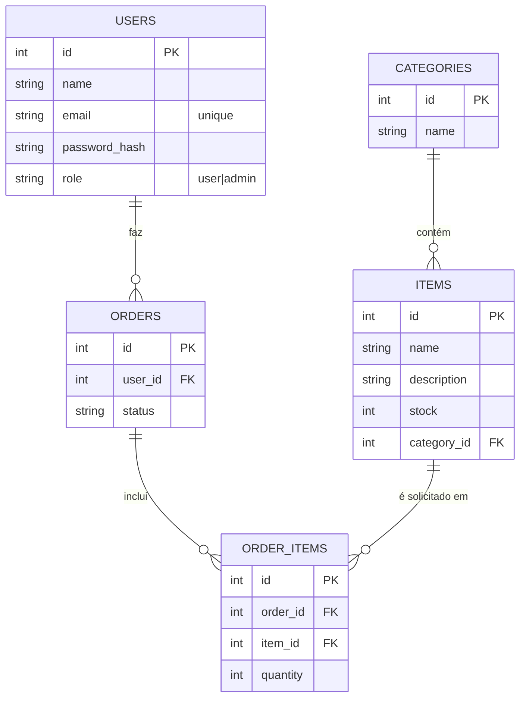

# ElectroStock

**ElectroStock** é uma aplicação **full-stack** para **controle de estoque** e **gestão de pedidos** de componentes eletrônicos. O sistema possui autenticação via **JWT**, controle de acesso por perfil (**user** e **admin**) e um fluxo de aprovação de pedidos com status (`pending`, `approved`, `rejected`, `finished`).

O projeto é composto por:
- **Backend (API)** em **FastAPI** + **SQLAlchemy** + **SQLite**
- **Frontend (Web)** em **React** (SPA) com dashboards separados para usuário e administrador

---

## 📋 Visão Geral

### Principais fluxos
- **Usuário (user)**
  - Visualiza itens disponíveis e estoque
  - Monta carrinho e **cria pedidos**
  - Acompanha o status dos próprios pedidos (**`GET /orders/me`**)
  - Edita perfil (email e/ou senha)
- **Administrador (admin)**
  - Visualiza pedidos por status (pendente/aprovado/recusado/finalizado)
  - Aprova, recusa e finaliza pedidos
  - Acessa **relatórios resumidos** no painel admin (total de pedidos, itens solicitados, usuários únicos, top itens)

---

## ✅ Funcionalidades

### Autenticação e autorização
- Registro de usuário
- Login com geração de token JWT
- Rotas protegidas via Bearer token
- Controle de acesso por perfil `user` e `admin`

### Estoque
- CRUD de categorias
- CRUD de itens com vínculo a categoria
- Controle de quantidade em estoque

### Pedidos
- Criação de pedidos com itens e quantidades
- **Listagem de pedidos do usuário** (rota **`GET /orders/me`**)
- **Listagem geral de pedidos** (admin) (rota **`GET /orders`**, protegida)
- Fluxo de status: `pending` → `approved` → `finished` (ou `rejected`)
- Itens do pedido armazenados em tabela associativa (**OrderItem**)
- Rota de detalhe protegida contra vazamento: usuário só acessa pedido próprio

---

## 🧰 Stack e ferramentas

### Backend
- Python 3.10+
- FastAPI
- Uvicorn
- Pydantic
- SQLAlchemy
- SQLite
- JWT (JSON Web Token)
- OAuth2 Password Flow (form-data) via `python-multipart`

### Frontend
- React + TypeScript
- React Router
- TailwindCSS (UI)
- Fetch API (integração HTTP com a API)

---

## 🗂 Estrutura do projeto

### Backend
- `backend/` (ou raiz, dependendo do seu layout)
- `app/main.py` instancia o FastAPI e registra routers
- `app/routers/` rotas por domínio: `auth`, `users`, `items`, `categories`, `orders`
- `app/models/` modelos SQLAlchemy e tabelas
- `app/schemas/` schemas Pydantic (request/response)
- `app/services/` regras de negócio
- `app/database.py` conexão e sessão do banco
- `app/core/` configurações, segurança e dependências (`get_current_user`, `require_admin`, etc.)

### Frontend
- `src/`
- `src/pages/` (ou equivalente)
  - `Dashboard.tsx` (usuário)
  - `DashboardAdmin.tsx` (admin)
  - `Login.tsx`, `Register.tsx` (autenticação)
- `src/routes/` (rotas do React Router, se houver)
- `src/components/` (componentes compartilhados, se houver)

---

## ▶️ Como rodar o projeto

### 1) Backend

1. Entre na pasta do backend (ajuste para o seu layout):
```bash
  cd backend
```
2. Crie e ative um ambiente virtual:
``` bash
chmod +x start_backend.sh
./start_backend.sh
```

### 2) Frontend
1. Instale as dependências do frontend:
```bash
  npm install
```
2. Inicie o servidor de desenvolvimento do frontend:
``` bash
npm run dev
```

## Estrutura do projeto

Organização modular por responsabilidade.

- `main.py` ponto de entrada do backend
- `app/main.py` instancia o FastAPI e registra os routers
- `app/routers/` rotas por domínio `auth` `users` `items` `categories` `orders` `order-items`
- `app/models/` modelos SQLAlchemy e tabelas
- `app/schemas/` schemas Pydantic de request e response
- `app/services/` regras de negócio
- `app/database.py` conexão e sessão do banco
- `app/core/` configurações e segurança

---

## 📋 Visão Geral

### Funcionalidades principais
- **Autenticação com JWT** (registro e login)
- **Usuário**
  - Visualiza itens disponíveis
  - Monta carrinho e **cria pedidos**
  - Acompanha status dos próprios pedidos
  - Edita perfil (email e/ou senha)
- **Administrador (admin)**
  - Visualiza pedidos por status (pendente/aprovado/recusado/finalizado)
  - Aprova, recusa e finaliza pedidos
  - Acesso a relatórios resumidos no painel admin

---

## 🧱 Modelo de Dados (ER)

Entidades principais (mínimo de 5 entidades relacionadas):
- **User**: usuários cadastrados (role `user` ou `admin`)
- **Category**: categorias de itens
- **Item**: itens do almoxarifado, vinculados a uma categoria
- **Order**: pedido criado por um usuário, com status
- **OrderItem**: itens dentro do pedido (associação entre Order e Item)

Diagrama ER (Mermaid):


## 🔑 Credenciais para teste

> **Atenção:** estas credenciais são apenas para ambiente local/de desenvolvimento.

- **Administrador (admin)**
  - Email: `weryyck@gmail.com`
  - Senha: `1456`

- **Usuário (user)**
  - Email: `testando@gmail.com`
  - Senha: `123456`
